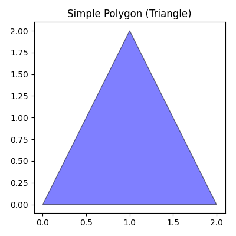
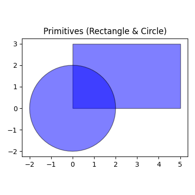
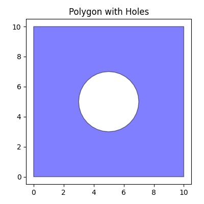
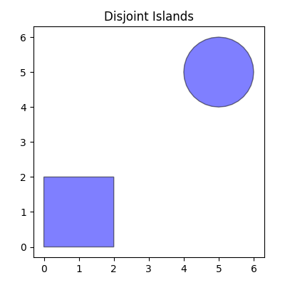
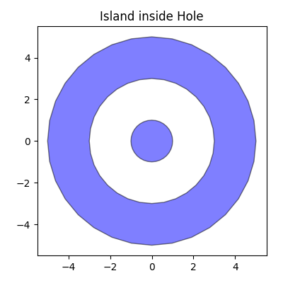

# dshape: Differentiable Shape Operations with JAX

`dshape` is a Python library for performing differentiable geometric operations on polygons, built on top of [JAX](https://github.com/google/jax). It enables gradient-based optimization of geometric shapes by providing differentiable implementations of common set and mutation operations.

## Features

- **Differentiable Mutations** (`dshape.mutation`):
    - `offset(p, dxy)`: Translate polygons.
    - `rotate(p, angle, center)`: Rotate polygons around a point.
    - `scale(p, factor, origin)`: Scale polygons (uniform/non-uniform) from an origin.
    - `buffer(p, distance)`: Dilate (>0) or erode (<0) polygons with straight (miter) or rounded (arc) corners.
- **Differentiable Set Operations** (`dshape.set_ops`):
    - `intersection(p1, p2)`: Sutherland-Hodgman clipping for polygons.
    - `union([p1, p2, ...])`: Construct unified geometry from a sequence of polygons.
    - `difference(p1, p2)`: Subtract one polygon from another.
- **Constructive Geometry** (`dshape.constructive`):
    - `convex_hull(p)`: Computes the convex hull of a polygon (including multi-ring inputs).
- **JAX Integration**: Fully compatible with `jax.jit`, `jax.grad`, and `jax.vmap`.
- **Robustness**: Handles degenerate cases, self-intersections (pruning), and floating-point edge cases.

## Usage

### Polygon Definition

In `dshape`, a `Polygon` is the fundamental geometric primitive. It represents a 2D shape defined by one or more closed rings of vertices.
- **Exterior Rings** (Shells): Defined in Counter-Clockwise (CCW) order. Represent positive area.
- **Interior Rings** (Holes): Defined in Clockwise (CW) order. Represent negative area.

A `Polygon` object is a JAX PyTree, meaning it can be passed into JIT-compiled functions. It stores vertices in a flat `(N, 2)` array and tracks topology via `ring_counts`.

#### 1. Simple Polygon
You can define a simple polygon by providing a list of vertices.

```python
import jax.numpy as jnp
from dshape import geometry

# A simple triangle
vertices = jnp.array([[0., 0.], [2., 0.], [1., 2.]])
triangle = geometry.Polygon(vertices=vertices, count=3)
```


#### 2. Primitives (Shorthand)
`dshape` provides helper classes for common shapes.

```python
# Rectangle defined by (x, y, width, height)
rect = geometry.Rectangle(0., 0., 5., 3.)

# Circle defined by (center_xy, radius)
# approximated by a polygon with `num_edges` (default 32)
circle = geometry.Circle((0., 0.), 2.0, num_edges=64)
```


#### 3. Polygon with Holes
To create shapes with holes, use the `from_exteriors_interiors` factory. It accepts lists of polygons (shells and holes) and handles the data layout for you.

```python
outer = geometry.Rectangle(0., 0., 10., 10.)
inner_hole = geometry.Circle((5., 5.), 2.0)

# Square with a circular hole
shape_with_hole = geometry.Polygon.from_exteriors_interiors(
    exteriors=[outer],
    interiors=[inner_hole]
)
```


#### 4. Disjoint Islands (Multi-Polygon)
A single `Polygon` object can represent multiple disjoint areas (a "MultiPolygon" in other conventions) by simply having multiple exterior rings.

```python
island1 = geometry.Rectangle(0., 0., 2., 2.)
island2 = geometry.Circle((5., 5.), 1.0)

# Single object representing both shapes
disjoint_shape = geometry.Polygon.from_exteriors_interiors(
    exteriors=[island1, island2]
)
```


#### 5. Island in a Hole
`dshape` supports complex nesting, such as an island inside a hole. Since the island represents positive area, it is treated as an **exterior** ring, even if it is geometrically inside a hole.

```python
# Annulus with an island in the center
outer = geometry.Circle((0., 0.), 5.0)  # Human perception: Main shell
hole = geometry.Circle((0., 0.), 3.0)   # Human perception: Hole
island = geometry.Circle((0., 0.), 1.0) # Human perception: Island inside hole

# We pass 'island' as an EXTERIOR because it is positive area
complex_shape = geometry.Polygon.from_exteriors_interiors(
    exteriors=[outer, island],
    interiors=[hole]
)
```



### Functional API

The primary API uses module-level functions that operate on `Polygon` objects.

```python
import jax.numpy as jnp
from dshape import geometry, set_ops, mutation

# Define a polygon
verts = jnp.array([[0.0, 0.0], [1.0, 0.0], [0.0, 1.0]])
poly = geometry.Polygon(vertices=verts, count=3)

# Offset (Translation)
offset = mutation.offset(poly, dxy=(0.1, 0.1))

# Rotate (Rotation)
rotated = mutation.rotate(poly, angle_rad=jnp.pi/4, center=[0.5, 0.5])

# Scale (Scaling)
scaled = mutation.scale(poly, factor=2.0, origin=[0, 0])

# Buffer (Dilation)
buffered = mutation.buffer(poly, distance=0.1)

# Buffer (Erosion)
eroded = mutation.buffer(poly, distance=-0.1)

# Set Operations
p1 = geometry.Rectangle(0.0, 0.0, 1.0, 1.0)
p2 = geometry.Rectangle(0.5, 0.5, 1.0, 1.0)

union_res = set_ops.union([p1, p2])
inter_res = set_ops.intersection(p1, p2)
diff_res  = set_ops.difference(p1, p2)

# Convex Hull
hull = constructive.convex_hull(p1)
```

### Object-Oriented API (Methods & Operators)

For convenience, `dshape` provides method shortcuts and operator overloads directly on the `Polygon` class.

```python
# Mutation Methods
p_buf = p1.buffer(0.1)
p_off = p1.offset((1.0, 1.0))
p_rot = p1.rotate(jnp.pi/2, center=[0, 0])
p_scl = p1.scale(2.0, origin=[0, 0])

# Set Operations (Operators)
p_union = p1 + p2  # Union
p_diff  = p1 - p2  # Difference
p_inter = p1 * p2  # Intersection

# properties
hull = p1.convex_hull
```

## Known Limitations

- **Fixed Buffer Sizes**: All JAX operations require static buffer sizes (e.g., `max_vertices`, `max_rings`).
    - If an operation (e.g., union of many shapes) produces more vertices/rings than the buffer allows, the `overflow` flag will be set on the result.
    - **Mitigation**: Check `.overflow` and retry with larger buffers if necessary, or conservatively size buffers for your domain.
- **Coincident Edge Clipping**: The current `set_ops.intersection` (Sutherland-Hodgman) implementation has known precision limitations when clipping edges that are perfectly overlapping or collinear. 
    - **Mitigation**: Robust handling is prioritized for general cases; perturb inputs slightly if degenerate overlaps cause dropping of edges.
- **Planarization Cost**: The robust erosion algorithm uses an O(N²) segment intersection check. While optimized with `vmap`, it may be slow for polygons with thousands of vertices.

## Structure

- `src/dshape/`: Source code.
    - `geometry.py`: Core `Polygon` class.
    - `set_ops.py`: Intersection, Union, Difference.
    - `mutation.py`: Buffer, Offset, Rotate, Scale.
    - `constructive.py`: Convex Hull.
    - `planarize.py`: Robust planarization logic (graph reconstruction).
    - `plotting.py`: Visualization helpers (using `plotly`).
    - `core.py`: Internal geometric helpers (JAX kernels).
- `tests/`: Unit tests (using `pytest`).

## Testing

Run the test suite with:

```bash
pytest tests/
```
